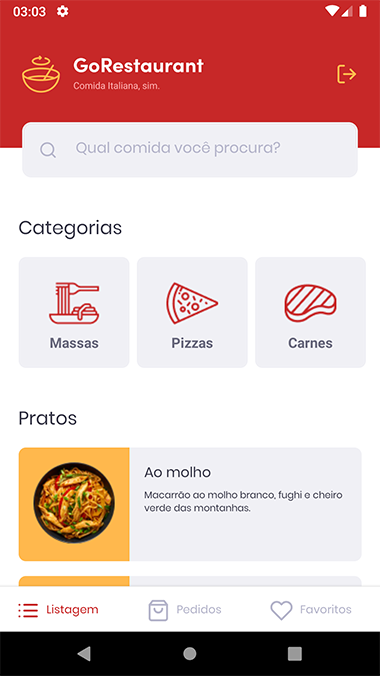
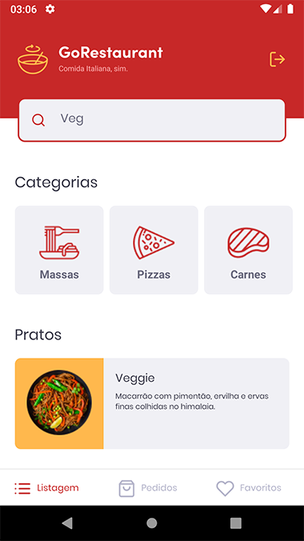
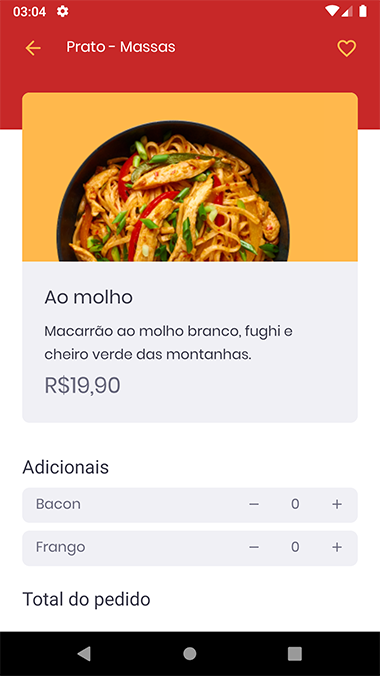
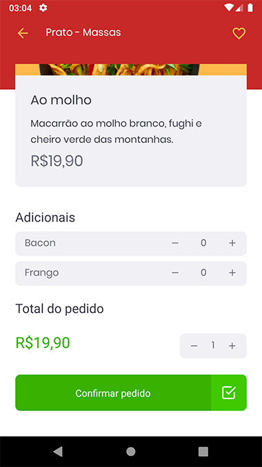

![GoStack Bootcamp][logo]

### Level 05 - Desafio: GoRestaurant Mobile

[📑 Instruções do desafio][challenge]
&nbsp; | &nbsp;
[👨🏻‍🎨 Layout do Figma][layout]

---

### 📷 Screenshots










---

### 📝 Instruções

1. Executar a *Fake API* com o comando abaixo:

    ```bash
    yarn json-server server.json -p 3333
    ```

2. Fake API

    | Método: | Rota: | Descrição: |
    |---------|-------|------------|
    | GET | /foods | Lista todos os pratos cadastrados no menu. |
    | GET | /foods/:id | Retorna um prato específico do menu. |
    | GET | /categories | Lista todas as categorias de pratos cadastradas. |
    | GET | /orders | Lista todos os pedidos cadastrados. |
    | GET | /favorites | Lista as comidas favoritas cadastradas. |

---

### ⚙ Testes

- [x] - `should be able to list the food plates`: Para que esse teste passe, sua aplicação deve permitir que sejam listados na sua Dashboard, todos os pratos de comidas que são retornados da sua fake API.

- [x] - `should be able to list the food plates filtered by category`: Para que esse teste passe, sua aplicação deve permitir que sejam listados na sua Dashboard, os pratos de comidas filtrados por categoria da sua fake API.

- [x] - `should be able to list the food plates filtered by name search`: Para que esse teste passe, sua aplicação deve permitir que sejam listados na sua Dashboard, os pratos de comidas filtrados por nome da sua fake API.

- [x] - `should be able to navigate to the food details page`: Para que esse teste passe, em sua Dashboard, você deve permitir que ao clicar em um item, seja navegado para a página FoodDetails passando por parâmetro da navegação o id do item clicado.

- [x] - `should be able to list the favorite food plates`: Para que esse teste passe, sua aplicação deve permitir que sejam listados na sua página `Favorites`, todos os pratos de comidas que estão salvos na rota `favorites`.

- [x] - `should be able to list the orders`: Para que esse teste passe, sua aplicação deve permitir que sejam listados na sua página `Orders`, todos os pratos de comidas que estão salvos na rota `orders`.

- [x] - `should be able to list the food`: Para que esse teste passe, sua aplicação deve permitir que seja listado todos os dados de uma comida específica na página `FoodDetails`, baseado no id recuperado pelos parametros da rota.

- [x] - `should be able to increment food quantity`: Para que esse teste passe, você deve permitir que seja incrementada em 1 a quantidade do item na página `FoodDetails`.

- [x] - `should be able to decrement food quantity`: Para que esse teste passe, você deve permitir que seja decrementada em 1 a quantidade do item na página `FoodDetails`.

- [x] - `should not be able to decrement food quantity below than 1`: Para que esse teste passe, você deve impedir que seja decrementado a quantidade de itens até um número menor que 1, assim o número mínimo de itens no pedido é 1.

- [x] - `should be able to increment an extra item quantity`: Para que esse teste passe, você deve permitir que seja incrementada em 1 a quantidade de um ingrediente extra na página `FoodDetails` baseado no seu id.

- [x] - `should be able to decrement an extra item quantity`: Para que esse teste passe, você deve permitir que seja decrementado em 1 a quantidade de um ingrediente extra na página `FoodDetails` baseado no seu id.

[logo]: https://github.com/leonardosposina/gostack13-lv01-d01/blob/master/docs/gostack-bootcamp.png?raw=true
[challenge]: https://github.com/rocketseat-education/bootcamp-gostack-desafios/tree/master/desafio-react-native-delivery
[layout]: https://www.figma.com/file/cHzfYrUBgdzp1XrRuUpggk/GoRestaurant-Mobile?node-id=1603%3A448
